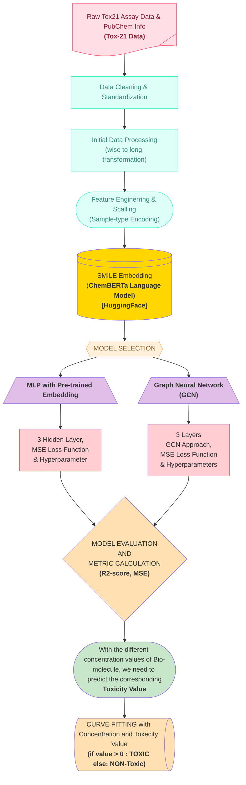
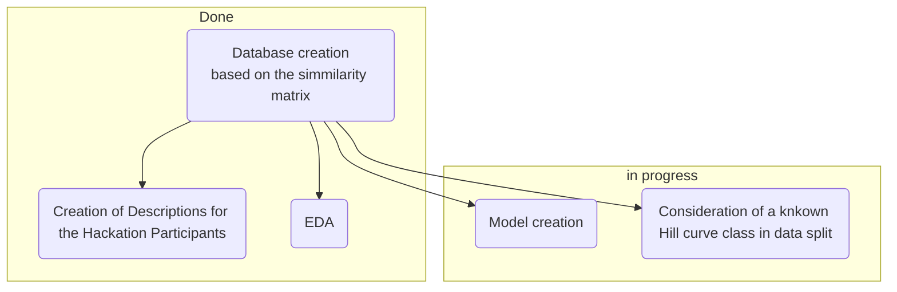

# Team9_Toxicological_Profiles
## Aim
Predicting Compound Toxicity using Deep Learning with Pre-trained Molecular Embeddings and Multi-Modal Assay Data

## Background
Estrogen related receptors (ERRs) are one of the first orphan nuclear receptors identified.[1] ERRs are required for high-energy production in response to the environmental and physiological challenges. They play an important role in the control of cellular energy, including mitochondrial biogenesis, gluconeogenesis, and oxidative phosphorylation[1, 2], with signaling implicated in metabolic disorders like type 2 diabetes[2], with EER-alpha (subfamily of EERs) identified as an adverse marker for breast cancer progression.[3] 
Screening and identifying environmental compounds that perturb the EER signaling pathways could provide information for potential preventive measures in treating the mentioned metabolic diseases.[1] Predicting their activity continuously allows for a quantitative assessment of receptor activation or inhibition, reflecting real biological responses more accurately than binary (toxic/nontoxic) labels, additionally allowing for information on dose-response that is not present in binary toxicity prediction.

## Contributors
- Marek Sokołowski
- Ritwik Ganguly
- Nilabja Bhattacharjee

## Methods
### Data Preprocessing and Graph Construction
Molecular data were obtained in SMILES format, each corresponding to a compound tested under varying concentrations for biological activity inhibition (e.g., from the Tox21 dataset). Each molecule was converted into a graph structure using RDKit, where atoms represent nodes and bonds represent edges. For each compound, a graph was constructed using the smiles2graph utility, and the resulting graphs were encapsulated in torch_geometric.data.Data objects.

Each node (atom) was featurized using the atom_features function, which encodes atomic number, degree, hybridization, aromaticity, and other physicochemical properties into a numerical feature vector. Edge indices were defined based on molecular bonds, but no explicit edge features were used.

To incorporate dose-dependent effects, the concentration value (log-transformed) was included as an additional scalar node-level feature, broadcast across all nodes in the graph. The final node feature dimension thus includes both structural atom-level information and experimental dosage context.

The dataset was split into training (80%), validation (10%), and test (10%) sets using stratified shuffling to preserve label distributions. The torch_geometric.loader.DataLoader was used to batch graphs with variable sizes efficiently for GNN processing. All features and targets were converted to float32 and normalized where necessary.

### Graph Neural Network Architecture
We employed a Graph Convolutional Network (GCN) architecture implemented using PyTorch Geometric. The model consists of:

Three stacked GCNConv layers with hidden dimensions of 64, 32, and 16, each followed by ReLU activation.

A global_mean_pool operation aggregates node-level embeddings into a graph-level representation.

Two fully connected (linear) layers map the pooled graph embedding to the final scalar output, representing the predicted % inhibition.

The model was trained to perform regression, using the Mean Squared Error (MSE) loss between predicted and experimental inhibition values.

### Training Procedure
The model was trained using the Adam optimizer with an initial learning rate of 1e-3 and a weight decay of 5e-4. A ReduceLROnPlateau scheduler was used to dynamically adjust the learning rate based on validation loss stagnation. Early stopping was employed with a patience of 20 epochs to prevent overfitting.

Each training epoch consisted of a forward pass, loss computation, backpropagation, and parameter update. Model performance was monitored on the validation set after each epoch. The best-performing model based on validation loss was checkpointed and subsequently used for final evaluation on the test set.

## Results
## Conclusions
### Future directions
## References
[1] Aubert G, Vega RB, Kelly DP. Perturbations in the gene regulatory pathways controlling mitochondrial energy production in the failing heart. In: Zhu H, Xia M, editors. Biochimica et Biophysica Acta (BBA) - Molecular Cell Research. Volume 1833, Issue 4. 1st ed. Elsevier; 2013. p. 840-847. https://doi.org/10.1016/j.bbamcr.2012.08.015. 
[2] Audet-walsh, É., Giguére, V. The multiple universes of estrogen-related receptor α and γ in metabolic control and related diseases. Acta Pharmacol Sin 36, 51–61 (2015). https://doi.org/10.1038/aps.2014.121 
[3] Huang R. A Quantitative High-Throughput Screening Data Analysis Pipeline for Activity Profiling. In: Zhu H, Xia M, editors. High-Throughput Screening Assays in Toxicology. Methods in Molecular Biology. 1473. 1 ed: Humana Press; 2016 

## Important Links
* link to the [dataset](https://drive.google.com/drive/folders/195KAyBS80Qdu5-uTHUWGVScDd4S7jBmM)
* [introduction to the problem](https://docs.google.com/presentation/d/1WYebbOqxnCUWdD_irGYNAFhBpz03HkJezKHb4039Ud0/edit#slide=id.g357624754e3_0_69)
* Simmilar solutions: [https://paperswithcode.com/sota/drug-discovery-on-tox21](https://paperswithcode.com/sota/drug-discovery-on-tox21)

## Dataset 
The dataset has been created to allow for learning models based on EER toxicity in the following manner:
Input: SMILES (string) and concentration (float).
Output (4-dimensional vector): DATA corresponding to agonist, DATA corresponding to antagonist, DATA corresponding to viability, and DATA corresponding to autofluorescence at the provided concentration.

With data split: 
train: 5640 samples, 
test: 704 samples, 
validation: 704 samples

### Columns Description
The [dataset](https://drive.google.com/drive/folders/195KAyBS80Qdu5-uTHUWGVScDd4S7jBmM) is based on the Tox21 Dataset merged with SMILES and IDs from Pubchem.
* **SAMPLE_DATA_TYPE**: distinguish channels:
   * *cell_red*: Autofluorescence of molecules
   * *agonist(1-3)*:
   * *antagonist(1-3)*:
   * *viability(1-3)*:<be>
where 1-3 indicates measurement repetition.

* **DATA(1-14)**: measurement of fluorescence in a specific experiment, it contains float values, positive and negative. None values indicate a lack of measurement
* **CONC(1-14)**: concentration in $\mu$M at which DATA is measured, it consists of positive float values, with None values in case of a lack of measurement
where each DATA is measured at a specific CONC indicated by id (ie, DATA1 is measured at CONC1, DATA2 is measured at CONC2, etc),

* **canonical_smiles**:
* **similarity_order**:
* **iupac_name**:

Information for tracking measurement or molecule source for data check: PUBCHEM_CID, TOX21_ID, SAMPLE_NAME, PUBCHEM_SID.
* **CURVE_CLASS2**: Tox21 group description of each measurement series (DATA/CONC 1-15) based on the Hill equation or set manually.
* **PubChemFingerprint**:
* **similarity_order**:

## Alternative Solutions
Based on the [Tox21 Dataset](https://tripod.nih.gov/pubdata/) there is [Therapeutics Data Commons (TDC)](https://arxiv.org/pdf/2102.09548v2) dataset, and [Tox24 Chalange](https://ochem.eu/static/challenge-data.do) dataset.<be>
[Tox21 benchmark](https://paperswithcode.com/dataset/tox21-1):
* [XGBoost](https://arxiv.org/pdf/2204.07532v3):

Tox24:
* [Keggle competitors](https://www.kaggle.com/datasets/antoninadolgorukova/tox24-challenge-data/code)
* [XGBoost](https://arxiv.org/pdf/2204.07532v3):
  * Features:
    1. Fingerprints: ErG, Mordred, Pubchem, MACCS, RDKit
    2. Fingerprints: 'fgr', 'datamol', 'ALogPSOEState', 'Mold2', 'SIRMSmix', 'MAP4', 'atombond', 'estate', 'JPlogP', 'ISIDAfragments'
  * algorithms:
    1. Cross-validation using XGBoost
    2. XGBoost

[Best TDC models according to Papers With Code](https://paperswithcode.com/dataset/tdcommons):
* [MapLight](https://arxiv.org/pdf/2310.00174v1)
  * Features:
    1. fingerprints: extended-connectivity fingerprints (ECFP), Avalon, and extended reduced graph approach (ErG),
    2. 200 molecular properties, including: "number of rings, molecular weight"
  * algorithms:
    1. Parameter search via grid search CV,
    2. CatBoost,
    3. LightGBM
* [XGBoost](https://arxiv.org/pdf/2204.07532v3):
  * Features:
    1. Fingerprints: MACCS, ECFP, Mol2Vec,
    2. Descriptors: Pubchem (881 distinct structural features), Molecular Access System (Mordred), RDKit
  * algorithms:
    1. Parameter search via randomized grid search CV,
    2. Extreme Gradient Boosting (XGBoost)

## Workflow:

    

## Hackaton Progress

